# Simple Docker

## Содержание
1. [Готовый докер] (#part-1-готовый-докер)
2. [Операции с контейнером] (#part-2-операции-с-контейнером)
3. [Мини веб-сервер] (#part-3-мини-веб-сервер)
4. [Свой докер] (#part-4-cвой-докер)
5. [Dockle] (#part-5-dockle)
6. [Базовый Docker Compose] (#part-6-базовый-docker-compose)

## Part 1. Готовый докер

Скачивание образа nginx:
* sudo docker pull nginx

Проверка наличия образа:
* sudo docker images

Запуск контейнера в фоновом режиме:
* sudo docker run -d nginx

Проверка всех запущенных контейнеров:
* sudo docker ps -a

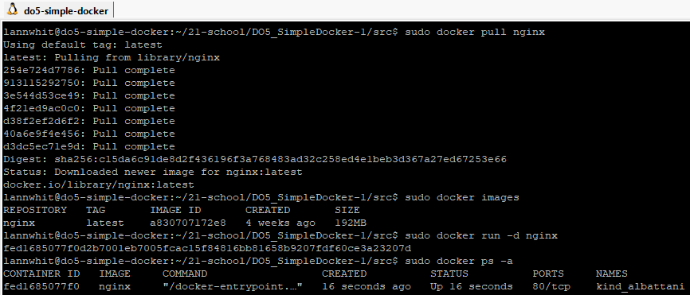

Просмотр информации о контейнере:
* sudo docker inspect fed1685077f0

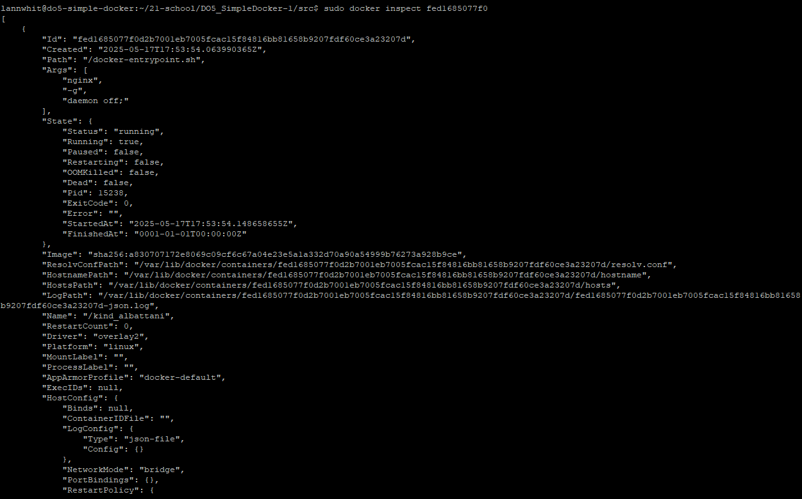

Остановка контейнера:
* sudo docker stop fed1685077f0

Проверка всех запущенных контейнеров (статус контейнера Exited, т.е выключен):
* sudo docker ps -a

Проверка, что контейнер остановлен:
* sudo docker ps

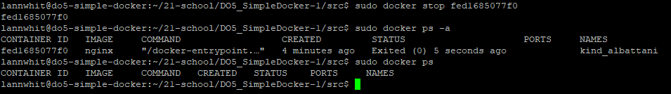

Запуск контейнера с пробросом портов 80 и 443:
* docker run -d -p 80:80 -p 443:443 nginx

Перезапуск контейнера:
* sudo docker restart 1c3b3d51de61

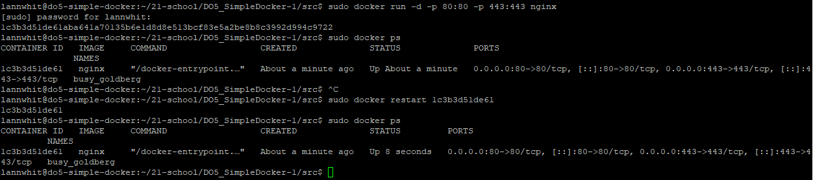

Проверка доступности веб-ресурса с помощью curl
* curl http://localhost:80

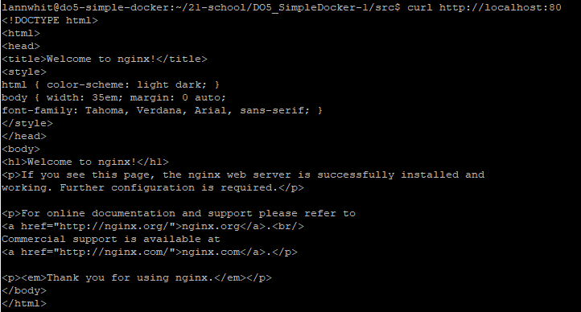

## Part 2. Операции с контейнером  

  
Разбираемся с конфигурацией nginx и отобразим статус страницы.

> Команда exec в контексте Docker используется для выполнения команды внутри запущенного контейнера.  
Чтобы прочитать конфигурационный файл nginx.conf внутри Docker контейнера через команду exec, использовал `docker exec barkopen cat /etc/nginx/nginx.conf`       
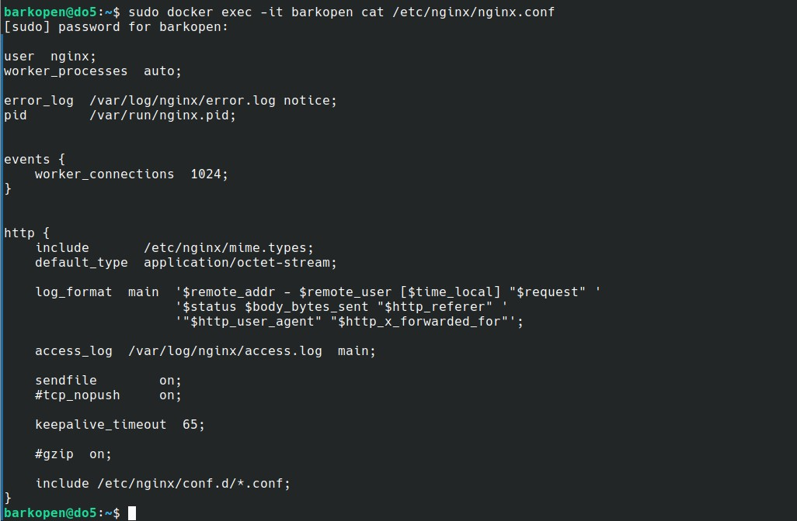 nginx.conf 

    

  
Выводим статус сервера на localhost:80/status

Создаём файл `nginx.conf`, скопировав содержимое оригинального файлафайла.  

Дописываем необходимое для выполнения задачи, настроим в нем по пути /status отдачу страницы статуса сервера nginx.                                            
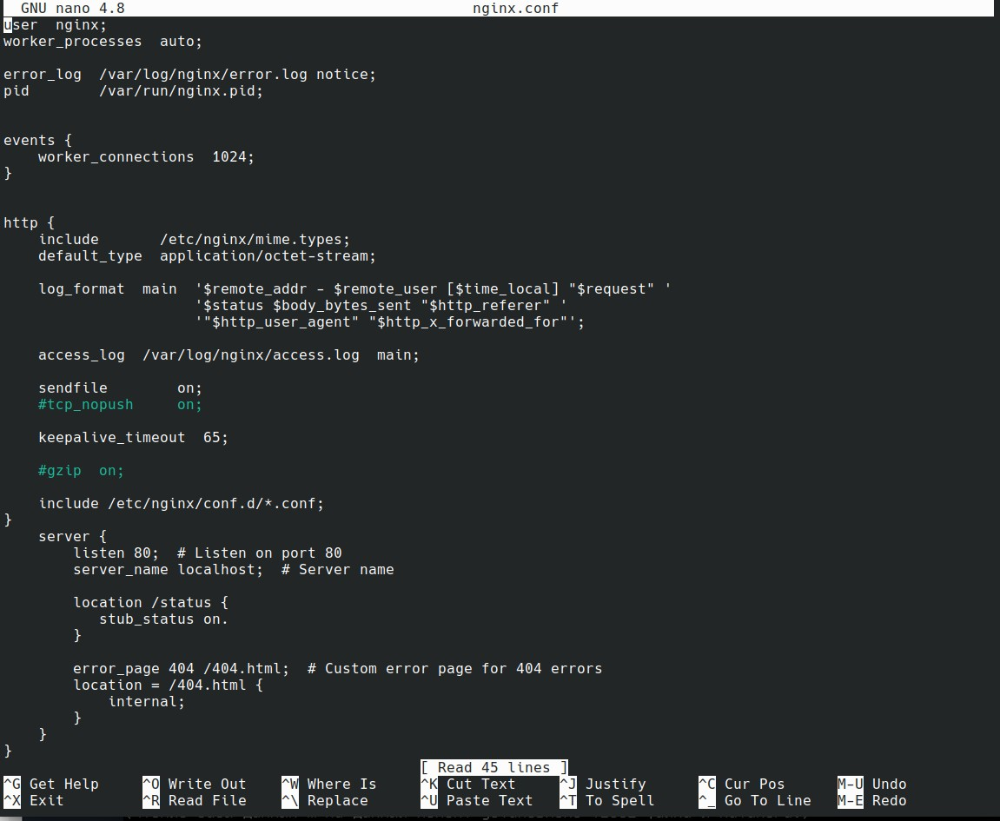  Исправленный nginx.conf 
 
 `location /status { ... }`: начинает блок конфигурации для обработки запросов к пути /status.
 
 `stub_status on;`: включает отдачу статуса сервера Nginx по пути /status.

Скопировал созданный файл *nginx.conf* внутрь докер-образа через команду `docker cp nginx.conf barkopen:/etc/nginx/nginx.conf`  
Проверил, что файл скопировался через `docker exec -it barkopen cat /etc/nginx/nginx.conf`                                                                       
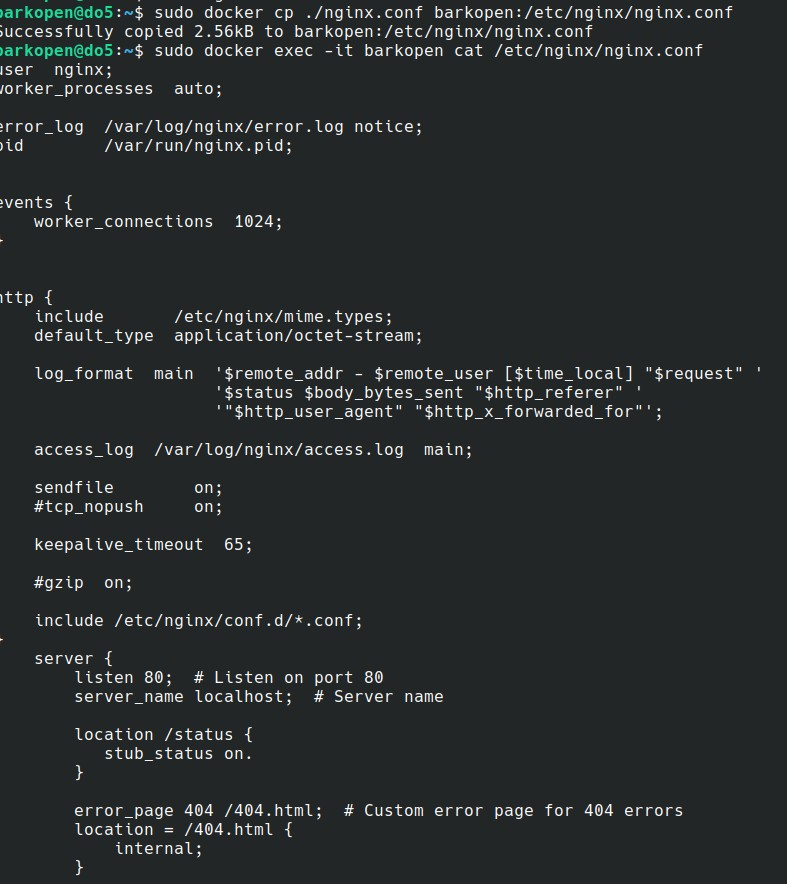  Проверяем исправленный nginx.conf 

Перезапустил **nginx** внутри докер-образа через команду `docker exec barkopen nginx -s reload`                                                                    
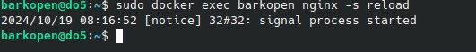  Пререзапуск 

Проверил, что по адресу `localhost:80/status` выдается страничка со статусом сервера **nginx** в тексовом браузере.                                          
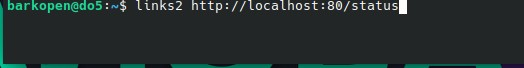 Link  

Также проверил выдачу страници в браузере Chrome.                                                                                                
 Вывод по запросу  

  

  
Сохраняем настройки с помощью export и import

Экспортировал контейнер в архив *container.tar* командой `docker export barkopen > container.tar`                                                               
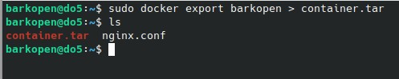 Экспортируем 

1. Остановил контейнер командой `docker stop barkopen`, проверил статус командой `docker ps -a`   
2. Удалил образ через `docker rmi -f nginx`, проверил через `docker images`     
3. Удалил остановленный контейнер командой `docker rm barkopen`, проверил через `docker ps -a`                                                                    
 Дейстрия 1 - 3  

Импортировал контейнер обратно командой `docker import container.tar my_image:latest`  и проверил `docker images`                                          
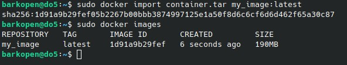 Импортировал контейнер 

Запустил импортированный контейнер командой `docker run -d -p 80:80 -p 443:443 --name barkopen my_image:latest nginx -g 'daemon off;'`
проверил через `docker ps.                                                                                                                                   
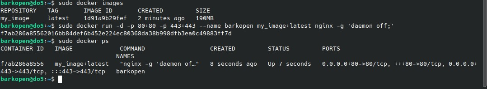 Запустил и проверил 

Проверил, что по адресу *localhost:80/status* выдается страничка со статусом сервера **nginx**.                                                             
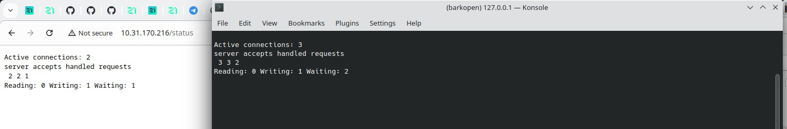 Выдача по запросу  

## Part 3. Мини веб-сервер

  
Отчет по мини-серверу

Пишем мини сервер на C и FastCgi, который будет возвращать простейшую страничку с надписью 'Hello World!',                                                       
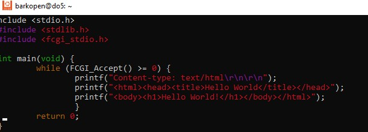 Вариант мини сервера на С 

Пишем свой nginx.conf, который будет проксировать все запросы с 81 порта на 127.0.0.1:8080                                                                  
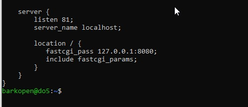 nginx.conf 

Заходим в контейнер командой docker exec -it [container id/container name] bash
 и в bash, обновляем репозитории, устанавливаем gcc, spawn-fcgi и libfcgi-dev                                                                                   
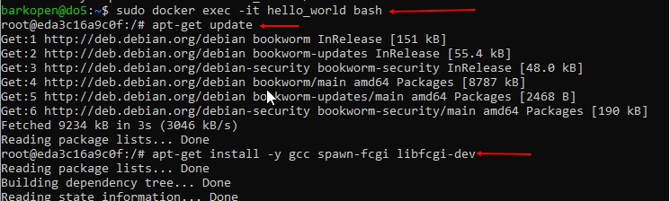 Вход в контейнер 

Скомпилировали написанный мини сервер                                                                                                                           
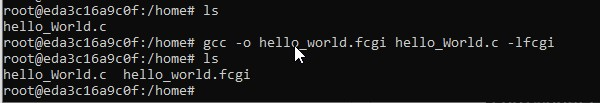 Компиляция 

Запустили написанный мини сервер через spawn-fcgi на порту 8080
Применили изменения в настройках сервера:                                                                                                                       
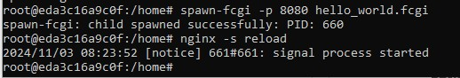 Запускаем 

 Проверяем, что в браузере по localhost:81 отдается написанная страничка. 
 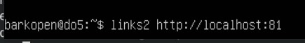 Link 

 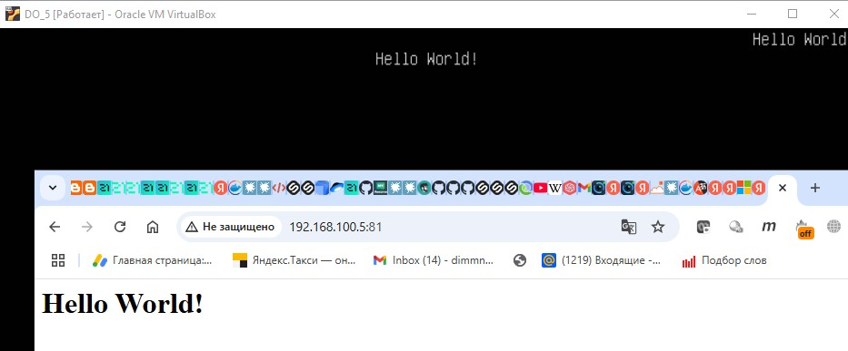 Выдача по запросу 

 Положи файл nginx.conf по пути ./nginx/nginx.conf (это понадобится позже).                                                                                       
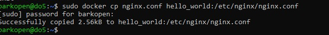 Последняя задача 

## Part 4. Свой докер  

  
Создаём докер-образ для созданного сервера

Напишем Dockerfile.                                                                                                                                        

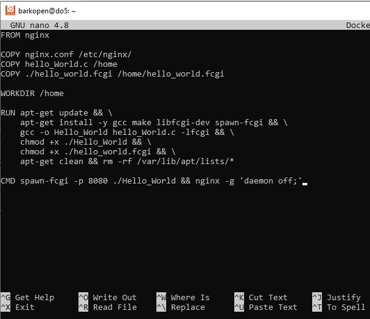 Dockerfile 

Соберём написанный докер-образ через `docker build -t barkopener:part_4 .` указав имя и тег                                                                       
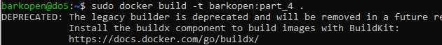 Сборка образа 

Проверил через `docker images`, что все собралось корректно                                                                                               
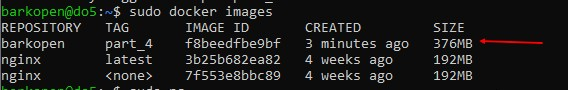 Проверяем наличие собранного образа 

  
Запуск образа

Запустим собранный докер-образ с маппингом 81 порта на 80 на локальной машине и маппингом папки *./nginx* внутрь контейнера по адресу, где лежат конфигурационные файлы **nginx**'а командой `docker run -d -p 80:81 -v "$(pwd)/nginx/nginx.conf:/etc/nginx/nginx.conf" my_fastcgi_server:part_4`  
Проверил, что по *localhost:80* доступна страничка написанного мини сервера                                                                                     
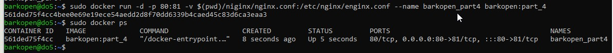 Запуск образа 

 Результат выдачи 

  
Допиши в ./nginx/nginx.conf проксирование странички /status, 
  по которой надо отдавать статус сервера nginx.

Дописал в *./nginx/nginx.conf* проксирование странички */status*, по которой надо отдавать статус сервера.                                                       
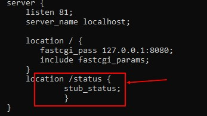 Изменения в nginx.conf 

Перезапустил контейнер командой `docker restart <CONTAINER_NAME>`     
*после сохранения файла и перезапуска контейнера, конфигурационный файл внутри докер-образа обновился*  
Проверил, что теперь по *localhost:80/status* отдается страничка со статусом                                                                                
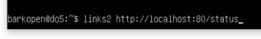 Link 

 Результат выдачи 
 

## Part 5. **Dockle**  

  
Проверка образа на безопасность с помощью Dockle

Устанавливаем Dockle. Инструкцию смотрел тут https://habr.com/ru/companies/timeweb/articles/561378/                                                            
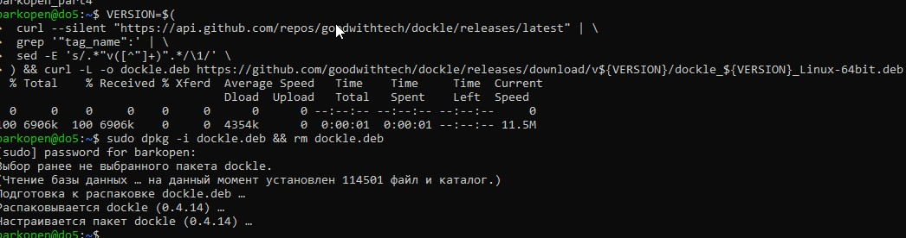 Установка 

Просканировал образ из предыдущего задания через `dockle barkopen:part_4`                                                                                       
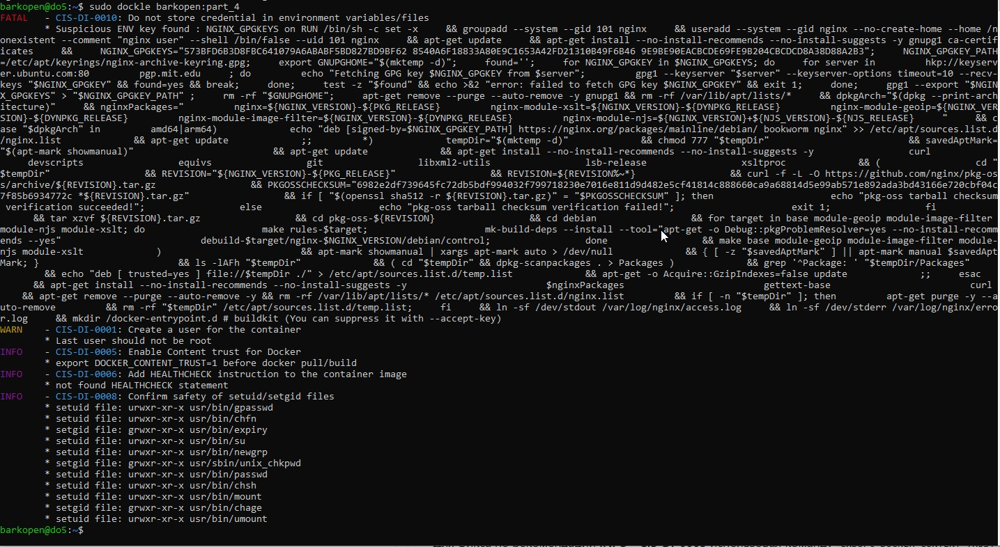 Выявили ошибки 

Исправил образ так, чтобы при проверке через **dockle** не было ошибок и предупреждений                                                                         

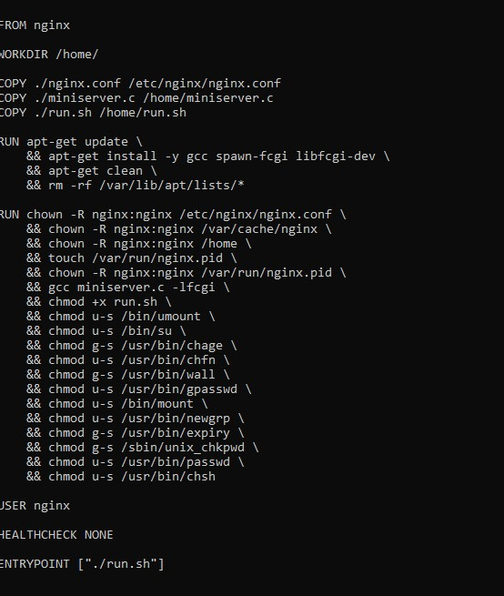 Обновлённый Докерфайл    

Для решения ошибки **FATAL - CIS-DI-0010**  использовал команду с `dockle --ak NGINX_GPGKEY --ak NGINX_GPGKEY_PATH`,  которая позволяет подтвердить использование конкретных ключей для работы нашего nginx сервера    
Для фикса по рекомендации **INFO - CIS-DI-0005** использовал команду `export DOCKER_CONTENT_TRUST=1`  
я.   

Написал run.sh 
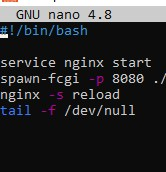 Добавленный скрипт                                                                                                           

Сборка докер-образа и проверка его работоспособности с помощью dockle                                                                                        
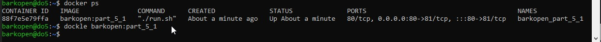 Перепроверили после изменений 

## Part 6. Базовый **Docker Compose**

  
Отчёт

Устанавливаем docker-compose                                                                                                                                      
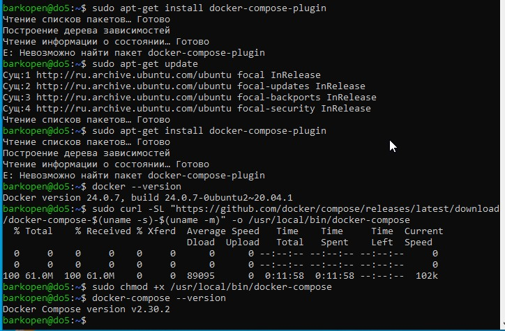 Установка 

Парвим nginx.conf который будет проксировать все запросы с 8080 порта на 81 порт первого контейнера. 
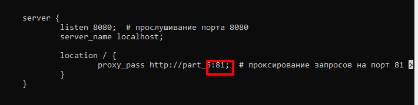 Дописали nginx.conf 

Пишим простой файл `docker-compose.yml`                                                                                                                       
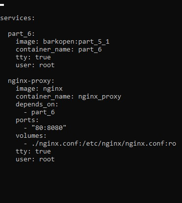 Docker-compose.yml 

Поднимаем контэйнеры используя команду docker-compose up -d задав имена  nginx_proxy  и  part_6                                                                  
 Свежие контейнерыbr>

Останавил контейнеры командой `down`                                                                                                                           
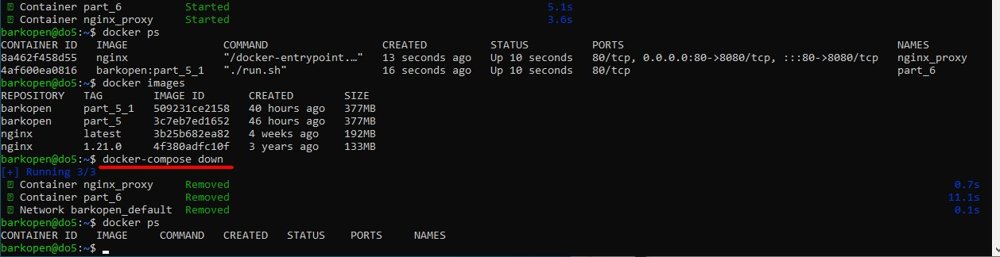 Остонока контейнеров 

Внёс изменения в файл `docker-compose.yml` , так как в дальнейшем будим билдить образы.                                                                          
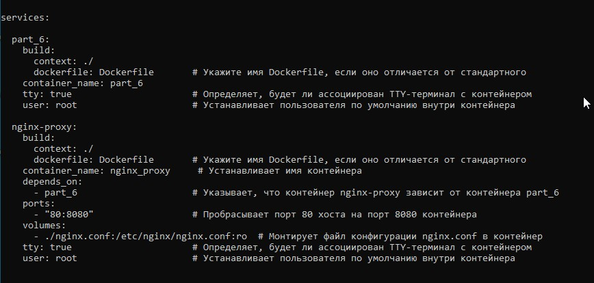 Обновлённый *.yml  

Все готово для использования команды `docker-compose build`                                                                                                
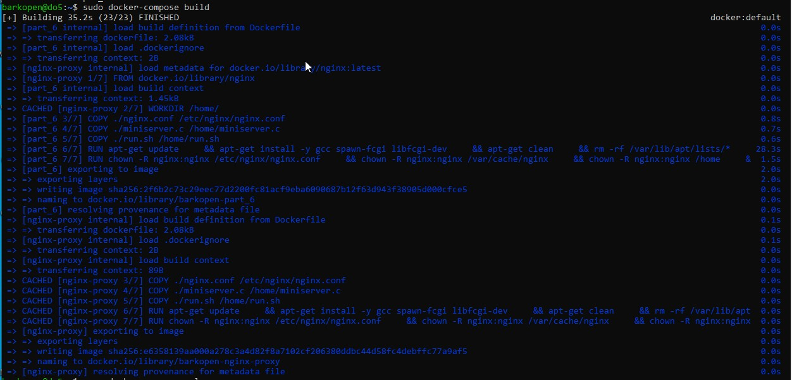 Результат билдинга 

Проверяем командой `docker images` наличие образов, и запускаем  `decker-compose up -d`
`docker ps` проверяем , что всё работает                                                                                                                          
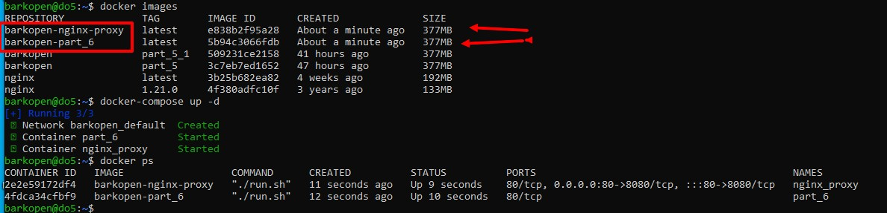 Проверяем наличие образов 

 
Проверил `curl` и запросом в браузере что всё работает отлично.                                                                                               
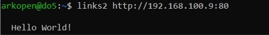 Результат запросв в браузере  

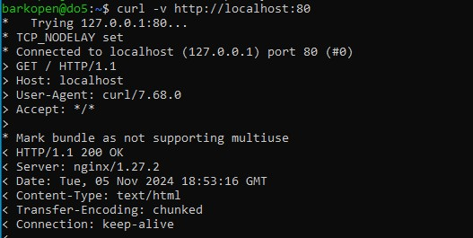 Выдача `curl` 

 

